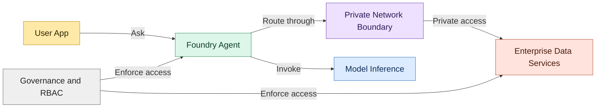
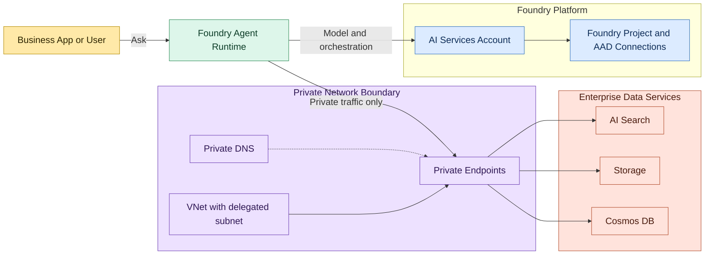
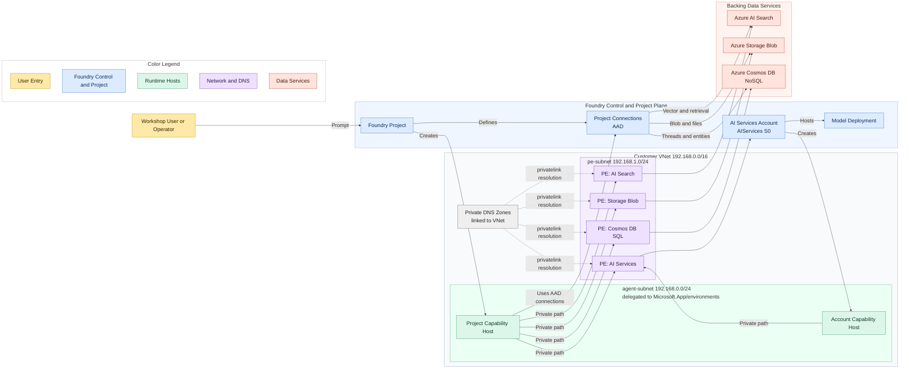

# Architecture Overview: Private Network Azure AI Foundry Agent

This document provides a concise architecture view of the private-network Foundry agent pattern used in this workshop suite.

## 1. Architecture at a Glance

Choose the view below based on audience depth.

### 1.1 Keynote View (6-Box Story)

### 1.2 Executive View (Slide-Friendly)

### 1.3 Technical View (Implementation Detail)

## 2. Core Components

| Layer | Component | Purpose |
|---|---|---|
| Control plane | AI Services account | Hosts model deployments and account capability host configuration |
| Project plane | Foundry project | Owns project managed identity and project-level connections |
| Runtime | Account capability host | Enables network-injected runtime in delegated subnet |
| Runtime | Project capability host | Binds Search, Storage, and Cosmos connections for agent tools |
| Data services | AI Search, Storage, Cosmos DB | Retrieval, blob storage, and thread/entity persistence |
| Network | Private endpoints + private DNS | Keeps data plane traffic private and name resolution internal |

## 3. Request and Data Flow

1. User invokes agent from approved private access path.
2. Foundry project routes to deployed model in AI Services account.
3. Agent runtime uses project capability host for tool access.
4. Tool calls resolve service FQDNs through private DNS zones.
5. Calls reach private endpoints in pe-subnet.
6. Backing services enforce AAD and RBAC with project managed identity.
7. Results return to runtime and then to user.

## 4. Security and Governance Controls

- Public network access disabled on AI Services, Search, Storage, and Cosmos DB.
- AAD-based project connections instead of key-based auth.
- Least-privilege RBAC on storage, search, and cosmos scopes.
- Private endpoint approval and DNS linkage as deployment gates.
- Capability host provisioning state used as operational health signal.

## 5. Critical Dependencies

- `agent-subnet` must be delegated to `Microsoft.App/environments`.
- Required RBAC must exist before project capability host creation.
- Private DNS zones must be linked to the VNet and contain A records.
- Project capability host must show `Succeeded` with all three connection arrays populated.

## 6. Verification Checklist

- Account capability host: `Succeeded`
- Project capability host: `Succeeded`
- Project connections: `CosmosDB`, `AzureStorageAccount`, `CognitiveSearch` using `AAD`
- Private endpoints: `Approved` for AI Services, Search, Storage, Cosmos DB
- DNS records resolve to private range used by pe-subnet
