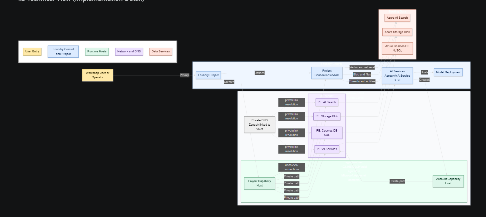
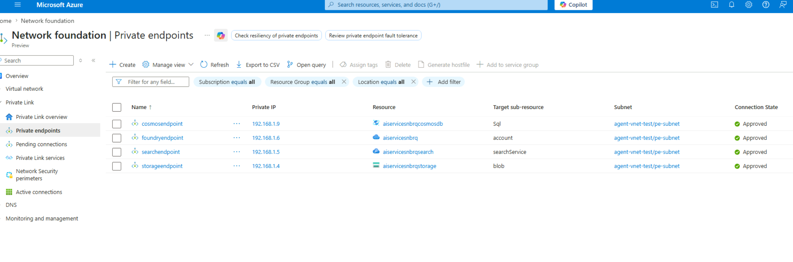
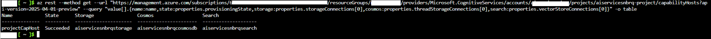

# Step-by-Step: Create Azure AI Foundry Agent with Private Network (E2E)


This guide walks you through manually creating a fully network-isolated Foundry agent environment from scratch, including every resource, RBAC role, connection, and capability host needed.

> Based on the [15-private-network-standard-agent-setup](https://github.com/microsoft-foundry/foundry-samples/tree/main/infrastructure/infrastructure-setup-bicep/15-private-network-standard-agent-setup) template and lessons learned from real troubleshooting.

For a concise diagram-first summary, see `foundry-private-network-agent-architecture-overview.md`.

---

## Architecture Overview

```
┌─────────────────────────────────────────────────────────────────────┐
│  Virtual Network (e.g. 192.168.0.0/16)                              │
│                                                                     │
│  ┌──────────────────────┐    ┌──────────────────────────────────┐   │
│  │ agent-subnet         │    │ pe-subnet                        │   │
│  │ 192.168.0.0/24       │    │ 192.168.1.0/24                   │   │
│  │ Delegated to         │    │                                  │   │
│  │ Microsoft.App/       │    │  PE: AI Services (cognitivesvcs) │   │
│  │ environments         │    │  PE: AI Search                   │   │
│  │                      │    │  PE: Storage (blob)              │   │
│  │ ← Capability Host    │    │  PE: Cosmos DB (sql)             │   │
│  │   runtime lives here │    │                                  │   │
│  └──────────────────────┘    └──────────────────────────────────┘   │
│                                                                     │
│  Private DNS Zones (linked to VNet):                                │
│   - privatelink.cognitiveservices.azure.com                         │
│   - privatelink.openai.azure.com                                    │
│   - privatelink.services.ai.azure.com                               │
│   - privatelink.search.windows.net                                  │
│   - privatelink.blob.core.windows.net                               │
│   - privatelink.documents.azure.com                                 │
└─────────────────────────────────────────────────────────────────────┘

┌─────────────────────────────────────────────────────────────────────┐
│  Foundry Account (AIServices, S0)                                   │
│   ├── Model Deployment (e.g. gpt-4.1)                               │
│   ├── Account Capability Host (VNet injection → agent-subnet)       │
│   └── Project                                                       │
│        ├── Connections: CosmosDB, Storage, AI Search                │
│        └── Project Capability Host (links to connections)           │
│             ├── vectorStoreConnections → AI Search connection       │
│             ├── storageConnections → Storage connection              │
│             └── threadStorageConnections → CosmosDB connection       │
└─────────────────────────────────────────────────────────────────────┘
```

---

## Prerequisites

1. **Azure subscription** with Owner or Role-Based Access Administrator permissions
2. **Azure CLI** installed and logged in (`az login`)
3. **Sufficient quota** in your target region for all resources
4. **Register required resource providers:**

```powershell
az provider register --namespace 'Microsoft.CognitiveServices'
az provider register --namespace 'Microsoft.Storage'
az provider register --namespace 'Microsoft.Search'
az provider register --namespace 'Microsoft.Network'
az provider register --namespace 'Microsoft.App'
az provider register --namespace 'Microsoft.DocumentDB'
az provider register --namespace 'Microsoft.KeyVault'
az provider register --namespace 'Microsoft.ContainerService'
```

5. **VNet address-space region constraint:** This guide uses `192.168.0.0/16` (Class C), which works in any Azure region. If you instead choose a **Class A** range (`10.x.x.x`), it is only supported in: Australia East, Brazil South, Canada East, East US, East US 2, France Central, Germany West Central, Italy North, Japan East, South Africa North, South Central US, South India, Spain Central, Sweden Central, UAE North, UK South, West Europe, West US, West US 3. Use Class B (`172.16.x.x`) or C (`192.168.x.x`) ranges elsewhere.

---

## Step 1: Set Variables

Choose your names and region. All resources (except Cosmos DB if you lack quota) should be in the **same region**.

```powershell
# ── CUSTOMIZE THESE ──
$SUBSCRIPTION = "your-subscription-id"
$RG           = "your-resource-group"
$LOCATION     = "eastus"
$SUFFIX       = "myagent"   # short unique suffix for naming

# ── DERIVED NAMES ──
$ACCT_NAME    = "aiservices${SUFFIX}"      # Foundry account
$PROJECT_NAME = "project${SUFFIX}"         # Project
$SEARCH_NAME  = "aiservices${SUFFIX}search"
$STORAGE_NAME = "aiservices${SUFFIX}storage"
$COSMOS_NAME  = "aiservices${SUFFIX}cosmosdb"
$VNET_NAME    = "agent-vnet"
$AGENT_SUBNET = "agent-subnet"
$PE_SUBNET    = "pe-subnet"

az account set --subscription $SUBSCRIPTION
```

---

## Step 2: Create Resource Group

```powershell
az group create --name $RG --location $LOCATION
```

---

## Step 3: Create the Virtual Network and Subnets

```powershell
# Create VNet
az network vnet create `
  --name $VNET_NAME `
  --resource-group $RG `
  --location $LOCATION `
  --address-prefix "192.168.0.0/16"

# Agent subnet — delegated to Microsoft.App/environments (REQUIRED)
az network vnet subnet create `
  --name $AGENT_SUBNET `
  --resource-group $RG `
  --vnet-name $VNET_NAME `
  --address-prefixes "192.168.0.0/24" `
  --delegations "Microsoft.App/environments"

# Private endpoint subnet
az network vnet subnet create `
  --name $PE_SUBNET `
  --resource-group $RG `
  --vnet-name $VNET_NAME `
  --address-prefixes "192.168.1.0/24"
```

> **Important:** The agent subnet MUST be exclusively delegated to `Microsoft.App/environments`. Use at least /24 size. Do not share this subnet with other resources.

---

## Step 4: Create Backing Resources

### 4a. Azure AI Search

```powershell
az search service create `
  --name $SEARCH_NAME `
  --resource-group $RG `
  --location $LOCATION `
  --sku standard `
  --partition-count 1 `
  --replica-count 1 `
  --public-access Disabled `
  --auth-options aadOrApiKey `
  --aad-auth-failure-mode http401WithBearerChallenge `
  --identity-type SystemAssigned
```

### 4b. Azure Storage Account

```powershell
az storage account create `
  --name $STORAGE_NAME `
  --resource-group $RG `
  --location $LOCATION `
  --sku Standard_ZRS `
  --kind StorageV2 `
  --min-tls-version TLS1_2 `
  --allow-blob-public-access false `
  --public-network-access Disabled `
  --allow-shared-key-access false
```

### 4c. Azure Cosmos DB (NoSQL)

```powershell
az cosmosdb create `
  --name $COSMOS_NAME `
  --resource-group $RG `
  --locations regionName=$LOCATION failoverPriority=0 `
  --default-consistency-level Session `
  --kind GlobalDocumentDB `
  --capabilities EnableServerless `
  --public-network-access DISABLED `
  --enable-automatic-failover false `
  --disable-key-based-metadata-write-access true
```

> If you don't have Cosmos DB quota in your primary region, you can place it in another region. The private endpoint will still route traffic correctly, but it's recommended to keep everything co-located.

---

## Step 5: Create the AI Services Account (Foundry Account)

```powershell
# Get the agent subnet ID
$AGENT_SUBNET_ID = az network vnet subnet show `
  --resource-group $RG --vnet-name $VNET_NAME --name $AGENT_SUBNET `
  --query id -o tsv

# Create the AI Services account with VNet injection
# Using REST API because CLI doesn't support networkInjections directly
$accountBody = @"
{
  "location": "$LOCATION",
  "kind": "AIServices",
  "sku": { "name": "S0" },
  "identity": { "type": "SystemAssigned" },
  "properties": {
    "allowProjectManagement": true,
    "customSubDomainName": "$ACCT_NAME",
    "publicNetworkAccess": "Disabled",
    "networkAcls": {
      "defaultAction": "Deny",
      "virtualNetworkRules": [],
      "ipRules": [],
      "bypass": "AzureServices"
    },
    "networkInjections": [
      {
        "scenario": "agent",
        "subnetArmId": "$AGENT_SUBNET_ID",
        "useMicrosoftManagedNetwork": false
      }
    ],
    "disableLocalAuth": false
  }
}
"@
Set-Content -Path "account-body.json" -Value $accountBody -Encoding utf8NoBOM

az rest --method put `
  --url "https://management.azure.com/subscriptions/${SUBSCRIPTION}/resourceGroups/${RG}/providers/Microsoft.CognitiveServices/accounts/${ACCT_NAME}?api-version=2025-04-01-preview" `
  --body "@account-body.json"
```

> This creates the account AND the **account-level capability host** (the platform creates it implicitly because `networkInjections.scenario = "agent"` is set). Wait for it to succeed before proceeding.
>
> **Important:** Only one account-level capability host per Foundry account is allowed. Do **not** attempt to create a second one explicitly (e.g. via `PUT .../accounts/{name}/capabilityHosts/{name}`) — it will fail with `Conflict`. If you ever need to recreate it (after running `deleteCapHost.sh` against an existing account), use the upstream `add-account-capability-host.bicep` module with the opt-in flag.

### 5a. Deploy a Model

```powershell
az cognitiveservices account deployment create `
  --name $ACCT_NAME `
  --resource-group $RG `
  --deployment-name "gpt-4.1" `
  --model-name "gpt-4.1" `
  --model-format OpenAI `
  --model-version "2025-04-14" `
  --sku-name GlobalStandard `
  --sku-capacity 30
```

---

## Step 6: Create Private Endpoints and DNS Zones

You need 4 private endpoints and 6 DNS zones:

### 6a. Create Private DNS Zones

```powershell
$dnsZones = @(
  "privatelink.cognitiveservices.azure.com",
  "privatelink.openai.azure.com",
  "privatelink.services.ai.azure.com",
  "privatelink.search.windows.net",
  "privatelink.blob.core.windows.net",
  "privatelink.documents.azure.com"
)

foreach ($zone in $dnsZones) {
  az network private-dns zone create `
    --resource-group $RG `
    --name $zone

  az network private-dns link vnet create `
    --resource-group $RG `
    --zone-name $zone `
    --name "${zone}-link" `
    --virtual-network $VNET_NAME `
    --registration-enabled false
}
```

### 6b. Create Private Endpoints

```powershell
# AI Services (3 DNS zones: cognitiveservices, openai, services.ai)
az network private-endpoint create `
  --name "foundry-pe" `
  --resource-group $RG `
  --vnet-name $VNET_NAME `
  --subnet $PE_SUBNET `
  --private-connection-resource-id (az cognitiveservices account show -g $RG -n $ACCT_NAME --query id -o tsv) `
  --group-id account `
  --connection-name "foundry-connection"

az network private-endpoint dns-zone-group create `
  --resource-group $RG `
  --endpoint-name "foundry-pe" `
  --name "foundry-dns" `
  --private-dns-zone "privatelink.cognitiveservices.azure.com" `
  --zone-name "cognitiveservices"

az network private-endpoint dns-zone-group add `
  --resource-group $RG `
  --endpoint-name "foundry-pe" `
  --name "foundry-dns" `
  --private-dns-zone "privatelink.openai.azure.com" `
  --zone-name "openai"

az network private-endpoint dns-zone-group add `
  --resource-group $RG `
  --endpoint-name "foundry-pe" `
  --name "foundry-dns" `
  --private-dns-zone "privatelink.services.ai.azure.com" `
  --zone-name "services"

# AI Search
az network private-endpoint create `
  --name "search-pe" `
  --resource-group $RG `
  --vnet-name $VNET_NAME `
  --subnet $PE_SUBNET `
  --private-connection-resource-id (az search service show -g $RG -n $SEARCH_NAME --query id -o tsv) `
  --group-id searchService `
  --connection-name "search-connection"

az network private-endpoint dns-zone-group create `
  --resource-group $RG `
  --endpoint-name "search-pe" `
  --name "search-dns" `
  --private-dns-zone "privatelink.search.windows.net" `
  --zone-name "search"

# Storage (blob)
az network private-endpoint create `
  --name "storage-pe" `
  --resource-group $RG `
  --vnet-name $VNET_NAME `
  --subnet $PE_SUBNET `
  --private-connection-resource-id (az storage account show -g $RG -n $STORAGE_NAME --query id -o tsv) `
  --group-id blob `
  --connection-name "storage-connection"

az network private-endpoint dns-zone-group create `
  --resource-group $RG `
  --endpoint-name "storage-pe" `
  --name "storage-dns" `
  --private-dns-zone "privatelink.blob.core.windows.net" `
  --zone-name "blob"

# Cosmos DB (sql)
az network private-endpoint create `
  --name "cosmos-pe" `
  --resource-group $RG `
  --vnet-name $VNET_NAME `
  --subnet $PE_SUBNET `
  --private-connection-resource-id (az cosmosdb show -g $RG -n $COSMOS_NAME --query id -o tsv) `
  --group-id Sql `
  --connection-name "cosmos-connection"

az network private-endpoint dns-zone-group create `
  --resource-group $RG `
  --endpoint-name "cosmos-pe" `
  --name "cosmos-dns" `
  --private-dns-zone "privatelink.documents.azure.com" `
  --zone-name "cosmos"
```

### 6c. Verify DNS Records

```powershell
foreach ($zone in $dnsZones) {
  Write-Output "=== $zone ==="
  az network private-dns record-set a list -g $RG -z $zone --query "[].{name:name, ip:aRecords[0].ipv4Address}" -o table
}
```

Every zone should show an A record pointing to a `192.168.1.x` IP.

---

## Step 7: Create the Foundry Project with Connections

```powershell
# Create project with connections to all 3 backing services
# Get resource endpoints
$STORAGE_BLOB = az storage account show -g $RG -n $STORAGE_NAME --query "primaryEndpoints.blob" -o tsv
$COSMOS_ENDPOINT = az cosmosdb show -g $RG -n $COSMOS_NAME --query "documentEndpoint" -o tsv
$STORAGE_ID = az storage account show -g $RG -n $STORAGE_NAME --query id -o tsv
$COSMOS_ID = az cosmosdb show -g $RG -n $COSMOS_NAME --query id -o tsv
$SEARCH_ID = az search service show -g $RG -n $SEARCH_NAME --query id -o tsv
$COSMOS_LOCATION = az cosmosdb show -g $RG -n $COSMOS_NAME --query location -o tsv

# Create project
$projBody = @"
{
  "location": "$LOCATION",
  "identity": { "type": "SystemAssigned" },
  "properties": {
    "description": "Private network agent project",
    "displayName": "Agent Project"
  }
}
"@
Set-Content -Path "project-body.json" -Value $projBody -Encoding utf8NoBOM

az rest --method put `
  --url "https://management.azure.com/subscriptions/${SUBSCRIPTION}/resourceGroups/${RG}/providers/Microsoft.CognitiveServices/accounts/${ACCT_NAME}/projects/${PROJECT_NAME}?api-version=2025-04-01-preview" `
  --body "@project-body.json"

# Get project managed identity
$PROJECT_MI = az rest --method get `
  --url "https://management.azure.com/subscriptions/${SUBSCRIPTION}/resourceGroups/${RG}/providers/Microsoft.CognitiveServices/accounts/${ACCT_NAME}/projects/${PROJECT_NAME}?api-version=2025-04-01-preview" `
  --query "identity.principalId" -o tsv

Write-Output "Project managed identity: $PROJECT_MI"
```

### 7a. Create Project Connections

```powershell
# CosmosDB connection
$cosmosConn = @"
{
  "properties": {
    "category": "CosmosDB",
    "target": "$COSMOS_ENDPOINT",
    "authType": "AAD",
    "metadata": {
      "ApiType": "Azure",
      "ResourceId": "$COSMOS_ID",
      "location": "$COSMOS_LOCATION"
    }
  }
}
"@
Set-Content -Path "cosmos-conn.json" -Value $cosmosConn -Encoding utf8NoBOM
az rest --method put `
  --url "https://management.azure.com/subscriptions/${SUBSCRIPTION}/resourceGroups/${RG}/providers/Microsoft.CognitiveServices/accounts/${ACCT_NAME}/projects/${PROJECT_NAME}/connections/${COSMOS_NAME}?api-version=2025-04-01-preview" `
  --body "@cosmos-conn.json"

# Storage connection
$storageConn = @"
{
  "properties": {
    "category": "AzureStorageAccount",
    "target": "$STORAGE_BLOB",
    "authType": "AAD",
    "metadata": {
      "ApiType": "Azure",
      "ResourceId": "$STORAGE_ID",
      "location": "$LOCATION"
    }
  }
}
"@
Set-Content -Path "storage-conn.json" -Value $storageConn -Encoding utf8NoBOM
az rest --method put `
  --url "https://management.azure.com/subscriptions/${SUBSCRIPTION}/resourceGroups/${RG}/providers/Microsoft.CognitiveServices/accounts/${ACCT_NAME}/projects/${PROJECT_NAME}/connections/${STORAGE_NAME}?api-version=2025-04-01-preview" `
  --body "@storage-conn.json"

# AI Search connection
$searchConn = @"
{
  "properties": {
    "category": "CognitiveSearch",
    "target": "https://${SEARCH_NAME}.search.windows.net",
    "authType": "AAD",
    "metadata": {
      "ApiType": "Azure",
      "ResourceId": "$SEARCH_ID",
      "location": "$LOCATION"
    }
  }
}
"@
Set-Content -Path "search-conn.json" -Value $searchConn -Encoding utf8NoBOM
az rest --method put `
  --url "https://management.azure.com/subscriptions/${SUBSCRIPTION}/resourceGroups/${RG}/providers/Microsoft.CognitiveServices/accounts/${ACCT_NAME}/projects/${PROJECT_NAME}/connections/${SEARCH_NAME}?api-version=2025-04-01-preview" `
  --body "@search-conn.json"
```

---

## Step 8: Assign RBAC Roles to the Project Managed Identity

> **Critical:** All RBAC must be assigned BEFORE creating the project capability host. The capability host provisioner uses the project managed identity to create containers.

### 8a. Storage Roles

```powershell
# Storage Blob Data Contributor at the account scope is required for the project
# managed identity to enumerate/access blob containers during agent runtime.
# (Container-scoped Storage Blob Data Owner on the *-agents-blobstore container
#  is applied AFTER the capability host is created — see Step 10a.)
az role assignment create `
  --assignee-object-id $PROJECT_MI `
  --assignee-principal-type ServicePrincipal `
  --role "Storage Blob Data Contributor" `
  --scope $STORAGE_ID
```

### 8b. Cosmos DB Roles

```powershell
# Cosmos DB Operator (ARM role)
az role assignment create `
  --assignee-object-id $PROJECT_MI `
  --assignee-principal-type ServicePrincipal `
  --role "Cosmos DB Operator" `
  --scope $COSMOS_ID

# Cosmos SQL Built-in Data Contributor (data-plane role)
$cosmosRoleBody = @"
{
  "properties": {
    "roleDefinitionId": "${COSMOS_ID}/sqlRoleDefinitions/00000000-0000-0000-0000-000000000002",
    "principalId": "$PROJECT_MI",
    "scope": "$COSMOS_ID"
  }
}
"@
Set-Content -Path "cosmos-role.json" -Value $cosmosRoleBody -Encoding utf8NoBOM
$ROLE_GUID = [guid]::NewGuid().ToString()
az rest --method put `
  --url "https://management.azure.com${COSMOS_ID}/sqlRoleAssignments/${ROLE_GUID}?api-version=2024-12-01-preview" `
  --body "@cosmos-role.json"
```

### 8c. AI Search Roles

```powershell
# Search Index Data Contributor
az role assignment create `
  --assignee-object-id $PROJECT_MI `
  --assignee-principal-type ServicePrincipal `
  --role "Search Index Data Contributor" `
  --scope $SEARCH_ID

# Search Service Contributor
az role assignment create `
  --assignee-object-id $PROJECT_MI `
  --assignee-principal-type ServicePrincipal `
  --role "Search Service Contributor" `
  --scope $SEARCH_ID
```

### 8d. Wait for RBAC Propagation

```powershell
Write-Output "Waiting 60 seconds for RBAC propagation..."
Start-Sleep -Seconds 60
```

---

## Step 9: Create the Project Capability Host

> **This is the most critical step.** Without the project-level capability host, agents will fail with "Invalid endpoint or connection failed" when using any tools.

```powershell
$caphostBody = @"
{
  "properties": {
    "capabilityHostKind": "Agents",
    "vectorStoreConnections": ["$SEARCH_NAME"],
    "storageConnections": ["$STORAGE_NAME"],
    "threadStorageConnections": ["$COSMOS_NAME"]
  }
}
"@
Set-Content -Path "caphost.json" -Value $caphostBody -Encoding utf8NoBOM

# Create via REST API with async polling
$token = az account get-access-token --resource "https://management.azure.com" --query accessToken -o tsv

$putUri = "https://management.azure.com/subscriptions/${SUBSCRIPTION}/resourceGroups/${RG}/providers/Microsoft.CognitiveServices/accounts/${ACCT_NAME}/projects/${PROJECT_NAME}/capabilityHosts/projectCapHost?api-version=2025-04-01-preview"

$resp = Invoke-WebRequest -Uri $putUri -Method PUT `
  -Headers @{"Authorization"="Bearer $token"; "Content-Type"="application/json"} `
  -Body (Get-Content "caphost.json" -Raw) `
  -UseBasicParsing

$asyncUrl = $resp.Headers['Azure-AsyncOperation']
Write-Output "Capability host creating... Polling: $asyncUrl"

# Poll until complete
do {
  Start-Sleep -Seconds 15
  $token = az account get-access-token --resource "https://management.azure.com" --query accessToken -o tsv
  $status = (Invoke-RestMethod -Uri $asyncUrl -Headers @{"Authorization"="Bearer $token"}).status
  Write-Output "Status: $status"
} while ($status -eq 'Creating' -or $status -eq 'Running' -or $status -eq 'InProgress')

if ($status -eq 'Succeeded') {
  Write-Output "Project capability host created successfully!"
} else {
  Write-Output "FAILED: $status — check RBAC roles and retry"
}
```

### 9a. Verify Capability Host

```powershell
# Verify account-level capability host
az rest --method get `
  --url "https://management.azure.com/subscriptions/${SUBSCRIPTION}/resourceGroups/${RG}/providers/Microsoft.CognitiveServices/accounts/${ACCT_NAME}/capabilityHosts?api-version=2025-04-01-preview" `
  --query "value[].{name:name, state:properties.provisioningState, subnet:properties.customerSubnet}" -o table

# Verify project-level capability host
az rest --method get `
  --url "https://management.azure.com/subscriptions/${SUBSCRIPTION}/resourceGroups/${RG}/providers/Microsoft.CognitiveServices/accounts/${ACCT_NAME}/projects/${PROJECT_NAME}/capabilityHosts?api-version=2025-04-01-preview" `
  --query "value[].{name:name, state:properties.provisioningState, storage:properties.storageConnections[0], cosmos:properties.threadStorageConnections[0], search:properties.vectorStoreConnections[0]}" -o table
```

Both should show `provisioningState: Succeeded`.

---

## Step 10: Post-Capability Host RBAC (Container-Level Roles)

After the capability host is created, it provisions storage containers and Cosmos DB containers. Now assign container-level roles:

### 10a. Storage Container Roles

```powershell
# Get the project workspace ID (internal ID). This is the GUID prefix the
# capability host uses to name the auto-provisioned blob containers.
$WORKSPACE_ID = az rest --method get `
  --url "https://management.azure.com/subscriptions/${SUBSCRIPTION}/resourceGroups/${RG}/providers/Microsoft.CognitiveServices/accounts/${ACCT_NAME}/projects/${PROJECT_NAME}?api-version=2025-04-01-preview" `
  --query "properties.internalId" -o tsv

# Container names follow: {workspaceId}-azureml-blobstore and {workspaceId}-agents-blobstore.
# The internalId is a 32-char hex string; the container prefix uses it as-is (no hyphens).
$AGENTS_CONTAINER  = "${WORKSPACE_ID}-agents-blobstore"
$AZUREML_CONTAINER = "${WORKSPACE_ID}-azureml-blobstore"

Write-Output "Workspace ID: $WORKSPACE_ID"
Write-Output "Agents container:  $AGENTS_CONTAINER"
Write-Output "AzureML container: $AZUREML_CONTAINER"

# Storage Blob Data Owner on the agents-blobstore container (write/manage agent files)
az role assignment create `
  --assignee-object-id $PROJECT_MI `
  --assignee-principal-type ServicePrincipal `
  --role "Storage Blob Data Owner" `
  --scope "${STORAGE_ID}/blobServices/default/containers/${AGENTS_CONTAINER}"

# Storage Blob Data Contributor on the azureml-blobstore container (workspace artifacts)
az role assignment create `
  --assignee-object-id $PROJECT_MI `
  --assignee-principal-type ServicePrincipal `
  --role "Storage Blob Data Contributor" `
  --scope "${STORAGE_ID}/blobServices/default/containers/${AZUREML_CONTAINER}"
```

> If the role assignment fails with `ScopeNotFound`, the capability host has not yet finished
> provisioning the containers. Wait 1-2 minutes and retry, or verify the containers exist:
> `az storage container list --account-name $STORAGE_NAME --auth-mode login -o table`.

### 10b. Cosmos Container Roles

The capability host creates three Cosmos DB containers:
- `{workspaceId}-thread-message-store`
- `{workspaceId}-system-thread-message-store`
- `{workspaceId}-agent-entity-store`

The SQL Built-in Data Contributor role assigned in Step 8b covers data-plane access at the account scope, so no additional container-level role is needed.

---

## Step 11: Create an Agent in the Foundry Portal

1. **Access the portal securely** — You need a VM, VPN, or ExpressRoute within the VNet since public network access is disabled
2. Navigate to [AI Foundry](https://ai.azure.com)
3. Select your project
4. Go to **Agents** → **Create Agent**
5. Choose your deployed model (e.g., `gpt-4.1`)
6. Add tools (e.g., Azure AI Search) — the connections are already available
7. Test in the playground

---

## Step 12: (Optional) Add Azure AI Search Tool to Your Agent

If you want your agent to query an AI Search index:

### 12a. Create an Index

Upload data to the storage account, create a data source, indexer, and index via the Search portal or REST API.

### 12b. Grant Cognitive Services OpenAI User

If your search index uses vector embeddings from the same AI Services account:

```powershell
$ACCT_ID = az cognitiveservices account show -g $RG -n $ACCT_NAME --query id -o tsv

# Grant to the project managed identity
az role assignment create `
  --assignee-object-id $PROJECT_MI `
  --assignee-principal-type ServicePrincipal `
  --role "Cognitive Services OpenAI User" `
  --scope $ACCT_ID

# Grant to the account managed identity
$ACCT_MI = az cognitiveservices account show -g $RG -n $ACCT_NAME --query "identity.principalId" -o tsv
az role assignment create `
  --assignee-object-id $ACCT_MI `
  --assignee-principal-type ServicePrincipal `
  --role "Cognitive Services OpenAI User" `
  --scope $ACCT_ID
```

### 12c. Add the Search Connection to the Agent

In the Foundry portal, add the "Azure AI Search" tool to your agent. It will use the `CognitiveSearch` connection created in Step 7a.

---

## Verification Checklist

Run this to verify your entire setup:

```powershell
Write-Output "=== 1. Account Capability Host ==="
az rest --method get `
  --url "https://management.azure.com/subscriptions/${SUBSCRIPTION}/resourceGroups/${RG}/providers/Microsoft.CognitiveServices/accounts/${ACCT_NAME}/capabilityHosts?api-version=2025-04-01-preview" `
  --query "value[].{name:name, state:properties.provisioningState}" -o table

Write-Output "`n=== 2. Project Capability Host ==="
az rest --method get `
  --url "https://management.azure.com/subscriptions/${SUBSCRIPTION}/resourceGroups/${RG}/providers/Microsoft.CognitiveServices/accounts/${ACCT_NAME}/projects/${PROJECT_NAME}/capabilityHosts?api-version=2025-04-01-preview" `
  --query "value[].{name:name, state:properties.provisioningState}" -o table

Write-Output "`n=== 3. Project Connections ==="
az rest --method get `
  --url "https://management.azure.com/subscriptions/${SUBSCRIPTION}/resourceGroups/${RG}/providers/Microsoft.CognitiveServices/accounts/${ACCT_NAME}/projects/${PROJECT_NAME}/connections?api-version=2025-04-01-preview" `
  --query "value[].{name:name, category:properties.category, auth:properties.authType, target:properties.target}" -o table

Write-Output "`n=== 4. Private DNS Zones ==="
$dnsZones | ForEach-Object {
  $count = az network private-dns record-set a list -g $RG -z $_ --query "length(@)" -o tsv 2>$null
  Write-Output "${_}: ${count} A records"
}

Write-Output "`n=== 5. Private Endpoints ==="
az network private-endpoint list -g $RG --query "[].{name:name, subnet:subnet.id, state:privateLinkServiceConnections[0].privateLinkServiceConnectionState.status}" -o table

Write-Output "`n=== 6. Model Deployments ==="
az cognitiveservices account deployment list -g $RG -n $ACCT_NAME --query "[].{name:name, model:properties.model.name, sku:sku.name}" -o table

Write-Output "`n=== 7. Project managed identity RBAC on Storage ==="
az role assignment list --scope $STORAGE_ID --assignee $PROJECT_MI --query "[].roleDefinitionName" -o json

Write-Output "`n=== 8. Project managed identity RBAC on Cosmos ==="
az role assignment list --scope $COSMOS_ID --assignee $PROJECT_MI --query "[].roleDefinitionName" -o json

Write-Output "`n=== 9. Project managed identity RBAC on Search ==="
az role assignment list --scope $SEARCH_ID --assignee $PROJECT_MI --query "[].roleDefinitionName" -o json
```

**Expected results:**
- ✅ Account capability host: `Succeeded` with agent-subnet
- ✅ Project capability host: `Succeeded` with all 3 connections
- ✅ 3 project connections: CosmosDB (AAD), AzureStorageAccount (AAD), CognitiveSearch (AAD)
- ✅ 6 DNS zones each with A records
- ✅ 4 private endpoints all `Approved`
- ✅ At least 1 model deployment
- ✅ Storage (account scope): `Storage Blob Data Contributor` (plus container-scoped `Storage Blob Data Owner` on the `*-agents-blobstore` container after capability host creation)
- ✅ Cosmos: `Cosmos DB Operator` (+ SQL Built-in Data Contributor via data-plane)
- ✅ Search: `Search Index Data Contributor`, `Search Service Contributor`

---

## Troubleshooting

| Symptom | Likely Cause | Fix |
|---------|-------------|-----|
| `tool_user_error` / "Invalid endpoint or connection failed" | Missing project capability host | Create project capability host (Step 9) |
| Capability host provisioning `Failed` | Missing RBAC on Storage/Cosmos for project managed identity | Add roles in Step 8, delete failed capability host, recreate |
| "Virtual Network configured, use correct endpoint" | Calling API from outside VNet | Use VM/VPN inside VNet, or use private endpoints |
| Search indexer PermissionDenied on embeddings | Missing Cognitive Services OpenAI User | Grant role per Step 12b |
| "Subnet already in use" error on account create | Previous account not fully purged | Purge deleted accounts, wait 20 min |
| Agent can't access data in Search | Missing Search RBAC for project managed identity | Step 8c |

---

## Cleanup

> **Order matters:** Delete project capability host first, then account capability host, then purge the account.

```powershell
# 1. Delete project capability host
az rest --method delete `
  --url "https://management.azure.com/subscriptions/${SUBSCRIPTION}/resourceGroups/${RG}/providers/Microsoft.CognitiveServices/accounts/${ACCT_NAME}/projects/${PROJECT_NAME}/capabilityHosts/projectCapHost?api-version=2025-04-01-preview"

# Wait for completion (poll the Azure-AsyncOperation URL from response headers)
Start-Sleep -Seconds 120

# 2. Delete the entire resource group (includes all resources)
# az group delete --name $RG --yes --no-wait
```

---

## Quick Reference: Required RBAC Summary

| Target Resource | Role | Assigned To | When |
|-----------------|------|-------------|------|
| Storage Account | Storage Blob Data Contributor | Project managed identity | Before capability host |
| Cosmos DB | Cosmos DB Operator | Project managed identity | Before capability host |
| Cosmos DB | SQL Built-in Data Contributor (`00000000-...-000002`) | Project managed identity | Before capability host |
| AI Search | Search Index Data Contributor | Project managed identity | Before capability host |
| AI Search | Search Service Contributor | Project managed identity | Before capability host |
| AI Services Account | Cognitive Services OpenAI User | Project managed identity | For Search embedding tools |
| `*-agents-blobstore` container | Storage Blob Data Owner | Project managed identity | After capability host |
| `*-azureml-blobstore` container | Storage Blob Data Contributor | Project managed identity | After capability host |

---

## Quick Reference: Deployment Order

```
1.  Resource Group
2.  VNet + Subnets (agent-subnet delegated, pe-subnet)
3.  Backing resources (Search, Storage, Cosmos DB)
4.  AI Services Account (with networkInjections → creates account capability host)
5.  Model Deployment
6.  Private Endpoints + DNS Zones + VNet Links
7.  Project + Connections (CosmosDB, Storage, Search — all AAD auth)
8.  RBAC for project managed identity on all backing services
9.  Project Capability Host (links connections) ← MOST CRITICAL
10. Post-capability host container-level RBAC
11. Create agent in portal, add tools, test
```

---

## Screenshot Placeholders

Store reference screenshots in `assets/screenshots/reference/` and use these stable names:

- `01-architecture-overview.png`
- `02-private-endpoints-approved.png`
- `03-private-dns-records.png`
- `04-project-connections-aad.png`
- `05-project-caphost-succeeded.png`
- `06-agent-tool-validation.png`

Optional markdown placeholders:




