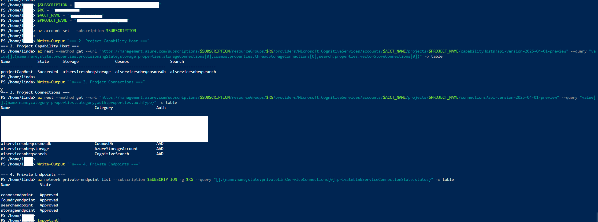

# 2-Hour Workshop: Private Network Azure AI Foundry Agent (Condensed)

Condensed format: GitHub Copilot
Series: Private Network Foundry Agent Workshop Suite  
Version: 2026-04-26  
Primary reference: foundry-private-network-agent-guide.md

## 0. How to Use This Version

Use this version for a fast, checkpoint-driven workshop when time is limited to two hours.

Related versions:
- Full workshop: foundry-private-network-agent-hands-on-workshop.md
- Executive demo: foundry-private-network-agent-workshop-executive-demo.md
- Engineer bootcamp: foundry-private-network-agent-workshop-engineer-bootcamp.md
- Trainer playbook: foundry-private-network-agent-workshop-internal-trainer-playbook.md

## 1. Outcome

In 120 minutes, participants deploy and validate a private-network Foundry agent stack with:
- Account capability host (private network)
- Project with AAD connections to Search, Storage, Cosmos DB
- Project capability host wired to all three services
- Basic agent test in Foundry portal

## 2. Time Plan (120 Minutes)

| Time | Segment | Goal |
|---|---|---|
| 0:00-0:10 | Kickoff | Architecture, success criteria, naming rules |
| 0:10-0:25 | Fast setup | Variables, resource group, VNet/subnets |
| 0:25-0:45 | Core resources | Search, Storage, Cosmos DB |
| 0:45-1:05 | Foundry account | AI Services account with network injection + model |
| 1:05-1:25 | Private path | Private endpoints + DNS zone linking |
| 1:25-1:45 | Project wiring | Project creation, connections, RBAC |
| 1:45-1:55 | Critical step | Project capability host creation + polling |
| 1:55-2:00 | Validation | Checklist and go/no-go summary |

## 3. Pre-Work (Must Complete Before Session)

Complete before entering the 2-hour lab window:
- Azure provider registrations
- Region and quota confirmation
- Azure CLI login
- Subscription access validation

Recommended command references are in the full guide:
- foundry-private-network-agent-guide.md
- foundry-private-network-agent-hands-on-workshop.md

## 4. Lab Steps (Compressed)

### Step A: Setup and Network (15 min)
1. Set variables and derived names.
2. Create resource group.
3. Create VNet and two subnets.
4. Ensure `agent-subnet` is delegated to `Microsoft.App/environments`.

Checkpoint A:
- Resource group exists.
- Subnets exist with correct CIDR.
- Delegation is present on `agent-subnet`.

### Step B: Backing Services (20 min)
1. Create AI Search with public access disabled.
2. Create Storage account with public network disabled and shared key disabled.
3. Create Cosmos DB with public network disabled.

Checkpoint B:
- All three resources are provisioned.
- Network hardening settings are in place.

### Step C: Foundry Account and Model (20 min)
1. Resolve `agent-subnet` id.
2. Create AI Services account with `networkInjections` via REST.
3. Deploy one model (for example gpt-4.1).

Checkpoint C:
- Account has `publicNetworkAccess: Disabled`.
- Model deployment is listed.

### Step D: Private Endpoints and DNS (20 min)
1. Create private DNS zones.
2. Link each zone to VNet.
3. Create private endpoints for Foundry, Search, Storage, Cosmos.
4. Create DNS zone groups.

Checkpoint D:
- Four private endpoints are approved.
- DNS zones contain expected A records in private range.

### Step E: Project, Connections, RBAC (20 min)
1. Create Foundry project.
2. Create three project connections (Cosmos, Storage, Search) with AAD auth.
3. Capture project managed identity object id.
4. Assign RBAC roles before project capability host:
   - Storage Blob Data Owner
   - Cosmos DB Operator
   - Cosmos SQL Built-in Data Contributor
   - Search Index Data Contributor
   - Search Service Contributor
5. Wait for propagation.

Checkpoint E:
- Three AAD connections are visible.
- Role assignments are visible at target scopes.

### Step F: Project Capability Host (10 min)
1. Create project capability host with all three connection arrays.
2. Poll async operation until done.
3. Verify account and project capability hosts are both `Succeeded`.

Checkpoint F:
- Project capability host provisioned successfully.
- Connection mapping fields are populated.

### Step G: Final Validation (5 min)
Run quick verification for:
- Capability host states
- Project connections
- Private endpoint states
- Model deployment

## 5. Success Criteria

Workshop is successful if all are true:
- Account capability host = Succeeded
- Project capability host = Succeeded
- 3 project connections exist and use AAD
- 4 private endpoints are Approved
- At least 1 model deployment exists

## 6. Fast Troubleshooting

| Symptom | Most likely cause | Fast action |
|---|---|---|
| Invalid endpoint or connection failed | Missing project capability host | Create/recreate project capability host |
| Capability host failed | Missing RBAC before project capability host | Reassign RBAC, wait, recreate project capability host |
| PermissionDenied on embeddings | Missing OpenAI User role | Grant Cognitive Services OpenAI User |
| Cannot reach endpoint | Request from outside private path | Use VM/VPN/ExpressRoute inside VNet path |

## 7. Facilitator Controls

- Stop after each checkpoint and verify one team live.
- Keep one known-good environment for comparison.
- If behind schedule, skip optional Search indexing and focus on capability host success.

## 8. Post-Session

Clean up to avoid cost:
1. Delete project capability host.
2. Delete resource group.

## Screenshot Placeholders

Store condensed-workshop screenshots in `assets/screenshots/hands-on-2h/`.

- `01-timebox-overview.png`
- `02-private-endpoints-approved.png`
- `03-project-caphost-succeeded.png`
- `04-final-validation-summary.png`

Optional markdown placeholders:

