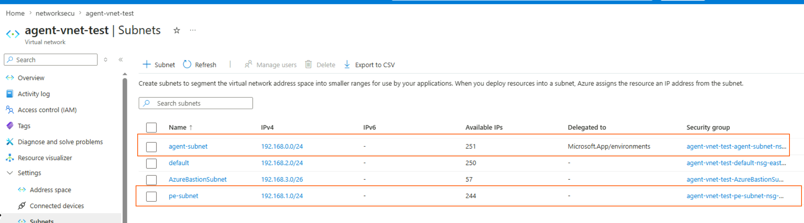

# Hands-on Workshop: Build a Private Network Azure AI Foundry Agent (E2E)

Author: Linda Zhang | AI APP GBB  
Workshop adaptation: GitHub Copilot
Series: Private Network Foundry Agent Workshop Suite  
Version: 2026-04-26  
Primary reference: foundry-private-network-agent-guide.md

## 0. How to Use This Version

Use this full version when teams need complete hands-on coverage from network setup through agent validation.

For alternate formats:
- Condensed run: foundry-private-network-agent-hands-on-workshop-2h.md
- Executive narrative: foundry-private-network-agent-workshop-executive-demo.md
- Deep technical day: foundry-private-network-agent-workshop-engineer-bootcamp.md
- Trainer delivery guide: foundry-private-network-agent-workshop-internal-trainer-playbook.md
- Slides and participant pack: foundry-private-network-agent-workshop-slide-outline.md, foundry-private-network-agent-participant-worksheet.md

## 1. Workshop Overview

This workshop turns the private network Foundry setup guide into a facilitator-ready, lab-based session. Participants will build a fully network-isolated Azure AI Foundry environment end to end, then create and test an agent with private connectivity to Search, Storage, and Cosmos DB.

By the end of the workshop, each participant team will have:
- A private VNet with delegated agent subnet and private endpoint subnet
- An AI Services account (Foundry account) with account-level capability host
- A Foundry project with three AAD-based connections
- A project-level capability host wired to Search, Storage, and Cosmos DB
- A working Foundry agent tested in a private network path

## 2. Audience and Duration

- Audience: Cloud architects, AI engineers, platform engineers, security engineers
- Skill level: Intermediate Azure (CLI, RBAC, networking)
- Duration: 4.5 to 5 hours including breaks
- Format: Team-based labs (1 facilitator + 2 to 4 participants per team)

## 3. Learning Objectives

Participants will be able to:
- Design and deploy a private-network AI Foundry architecture
- Configure project connections with AAD authentication only
- Assign required RBAC for project managed identity before capability host provisioning
- Diagnose common failures such as tool endpoint errors and capability host provisioning failures
- Validate deployment with a repeatable checklist

## 4. Lab Agenda

| Lab | Topic | Time |
|---|---|---:|
| Lab 0 | Setup and baseline checks | 25 min |
| Lab 1 | VNet and subnet foundation | 35 min |
| Lab 2 | Backing resources (Search, Storage, Cosmos DB) | 30 min |
| Lab 3 | AI Services account and model deployment | 40 min |
| Lab 4 | Private endpoints and private DNS | 35 min |
| Lab 5 | Project, connections, and RBAC | 55 min |
| Lab 6 | Project capability host and verification | 40 min |
| Lab 7 | Agent creation, tool test, troubleshooting drill | 35 min |
| Wrap-up | Review, Q and A, cleanup | 20 min |

## 5. Prerequisites

Each team needs:
- Azure subscription with `Owner` or `Role Based Access Administrator`
- Azure CLI installed and logged in
- Access to run PowerShell
- Sufficient quota for AI Services, Search, Storage, Cosmos DB
- Region that supports required subnet constraints for this setup

Register providers once per subscription:

```powershell
az provider register --namespace 'Microsoft.CognitiveServices'
az provider register --namespace 'Microsoft.Storage'
az provider register --namespace 'Microsoft.Search'
az provider register --namespace 'Microsoft.Network'
az provider register --namespace 'Microsoft.App'
az provider register --namespace 'Microsoft.DocumentDB'
az provider register --namespace 'Microsoft.KeyVault'
az provider register --namespace 'Microsoft.ContainerService'
```

## 6. Workspace Assets

The following files in this repo are useful payload templates for REST calls:
- `caphost.json`
- `cosmos-conn.json`
- `storage-conn.json`
- `search-conn.json`
- `cosmos-role-proj.json`

Facilitator tip: Ask teams to duplicate these files per team suffix to avoid collisions.

## 7. Lab 0 - Setup and Baseline Checks (25 min)

### Goal
Set naming variables and verify subscription context.

### Tasks
1. Set variables (replace placeholders).
2. Select target subscription.
3. Create the resource group.

```powershell
# Customize
$SUBSCRIPTION = "<subscription-id>"
$RG           = "rg-foundry-private-<team>"
$LOCATION     = "eastus"
$SUFFIX       = "<team>"

# Derived names
$ACCT_NAME    = "aiservices${SUFFIX}"
$PROJECT_NAME = "project${SUFFIX}"
$SEARCH_NAME  = "aiservices${SUFFIX}search"
$STORAGE_NAME = "aiservices${SUFFIX}storage"
$COSMOS_NAME  = "aiservices${SUFFIX}cosmosdb"
$VNET_NAME    = "agent-vnet"
$AGENT_SUBNET = "agent-subnet"
$PE_SUBNET    = "pe-subnet"

az account set --subscription $SUBSCRIPTION
az group create --name $RG --location $LOCATION
```

### Checkpoint
- `az group show -n $RG -o table` returns success.

## 8. Lab 1 - VNet and Subnet Foundation (35 min)

### Goal
Create required networking with a dedicated delegated subnet for agent runtime.

### Tasks
1. Create VNet `192.168.0.0/16`.
2. Create delegated `agent-subnet` (`192.168.0.0/24`) delegated to `Microsoft.App/environments`.
3. Create `pe-subnet` (`192.168.1.0/24`) for private endpoints.

```powershell
az network vnet create `
  --name $VNET_NAME `
  --resource-group $RG `
  --location $LOCATION `
  --address-prefix "192.168.0.0/16"

az network vnet subnet create `
  --name $AGENT_SUBNET `
  --resource-group $RG `
  --vnet-name $VNET_NAME `
  --address-prefixes "192.168.0.0/24" `
  --delegations "Microsoft.App/environments"

az network vnet subnet create `
  --name $PE_SUBNET `
  --resource-group $RG `
  --vnet-name $VNET_NAME `
  --address-prefixes "192.168.1.0/24"
```

### Checkpoint
- Delegation is visible on `agent-subnet`.
- No overlapping ranges.

## 9. Lab 2 - Backing Resources (30 min)

### Goal
Deploy private-network-ready data services for the agent toolchain.

### Tasks
1. Create AI Search (public access disabled).
2. Create Storage account (public access disabled, shared key disabled).
3. Create Cosmos DB NoSQL (public network disabled).

Use the command set from the base guide section "Step 4: Create Backing Resources".

### Checkpoint
- All three resources show `Succeeded` provisioning.
- Network access is disabled for each resource.

## 10. Lab 3 - AI Services Account and Model (40 min)

### Goal
Create the AI Services account with network injection and deploy one model.

### Tasks
1. Resolve delegated subnet id.
2. Submit account creation payload by REST (`api-version=2025-04-01-preview`).
3. Wait until account and account-level capability host are ready.
4. Deploy model (for example `gpt-4.1`).

Use the command set from base guide "Step 5" and "Step 5a".

### Checkpoint
- Account exists with `publicNetworkAccess=Disabled`.
- Model deployment appears in account deployment list.

## 11. Lab 4 - Private Endpoints and Private DNS (35 min)

### Goal
Enable private data path for all service dependencies.

### Tasks
1. Create six private DNS zones and link to VNet.
2. Create four private endpoints:
   - AI Services (`group-id account`)
   - AI Search (`group-id searchService`)
   - Storage (`group-id blob`)
   - Cosmos DB (`group-id Sql`)
3. Configure DNS zone groups for each endpoint.

Use base guide "Step 6".

### Checkpoint
- Each DNS zone has expected A records in `192.168.1.x`.
- Private endpoints show `Approved`.

## 12. Lab 5 - Project, Connections, and RBAC (55 min)

### Goal
Create project-level identities and grant least required roles before project capability host.

### Tasks
1. Create Foundry project.
2. Create three project connections with AAD auth:
   - `CosmosDB`
   - `AzureStorageAccount`
   - `CognitiveSearch`
3. Capture project managed identity object id.
4. Assign RBAC before project capability host:
   - Storage Blob Data Owner on storage account scope
   - Cosmos DB Operator on Cosmos account scope
   - Cosmos SQL Built-in Data Contributor data-plane role
   - Search Index Data Contributor and Search Service Contributor on search scope

Use base guide "Step 7" and "Step 8".

### Checkpoint
- Three connections are listed and each shows `authType=AAD`.
- Required role assignments are visible.

Facilitator note: Most failed workshops happen because teams skip role propagation wait time before project capability host creation.

## 13. Lab 6 - Project Capability Host and Verification (40 min)

### Goal
Create project capability host and validate end-to-end wiring.

### Tasks
1. Build project capability host payload with:
   - `vectorStoreConnections: [search]`
   - `storageConnections: [storage]`
   - `threadStorageConnections: [cosmos]`
2. Submit project capability host PUT call and poll async operation to completion.
3. Verify both account and project capability hosts are `Succeeded`.
4. Run consolidated verification checklist.

Use base guide "Step 9", "Step 9a", and "Verification Checklist".

### Checkpoint
- Project capability host is `Succeeded`.
- It shows all three mapped connections.

## 14. Lab 7 - Agent Creation and Tool Validation (35 min)

### Goal
Create an agent in Foundry portal and validate tool calls through private path.

### Tasks
1. Access Foundry portal from inside private connectivity path (VM, VPN, or ExpressRoute).
2. Create an agent using deployed model.
3. Add Azure AI Search tool from existing project connection.
4. Run test prompts in playground.

Optional: If using vector embeddings with same account, grant `Cognitive Services OpenAI User` as shown in base guide Step 12b.

### Checkpoint
- Agent can execute with tool enabled.
- No `Invalid endpoint or connection failed` errors.

## 15. Troubleshooting Drill (15 min)

Run one or two break/fix scenarios:

1. Scenario: `tool_user_error` invalid endpoint.
   - Cause: Missing project capability host.
   - Action: Recreate project capability host.

2. Scenario: capability host provisioning failed.
   - Cause: Missing RBAC on storage/cosmos/search for project managed identity.
   - Action: Reapply Step 8 roles, wait propagation, recreate project capability host.

3. Scenario: search indexer embedding permission denied.
   - Cause: Missing `Cognitive Services OpenAI User`.
   - Action: Grant role to project managed identity and account managed identity.

## 16. Deliverables Checklist

Each team should submit:
- Resource group name
- Screenshot or output of account capability host `Succeeded`
- Screenshot or output of project capability host `Succeeded`
- Output listing three project connections
- Output listing four private endpoints as `Approved`
- One successful agent test prompt with tool usage

## 17. Cleanup

For cost control, clean up after workshop:

1. Delete project capability host.
2. Delete resource group.

Use base guide cleanup section. If this is a shared subscription, confirm with facilitator before deletion.

## 18. Facilitator Runbook

- Start with architecture walkthrough (10 min).
- Use a single team as live demo for each lab start.
- Enforce stop points at each checkpoint.
- Reserve 20 to 30 min buffer for RBAC propagation and async capability host operations.
- Keep one known-good environment as reference for rapid comparison.

## 19. Suggested Pre-Read

- Foundry private network setup concept documentation
- Azure private endpoint and private DNS zone basics
- Managed identity and Azure RBAC fundamentals

---

If needed, this workshop can be extended with a Day 2 module for CI/CD deployment, policy controls, and automated post-deployment validation.

## Screenshot Placeholders

Store full-workshop screenshots in `assets/screenshots/hands-on/`.

- `01-network-foundation.png`
- `02-private-endpoints-approved.png`
- `03-project-connections-aad.png`
- `04-project-caphost-succeeded.png`
- `05-agent-tool-validation.png`

Optional markdown placeholders:



