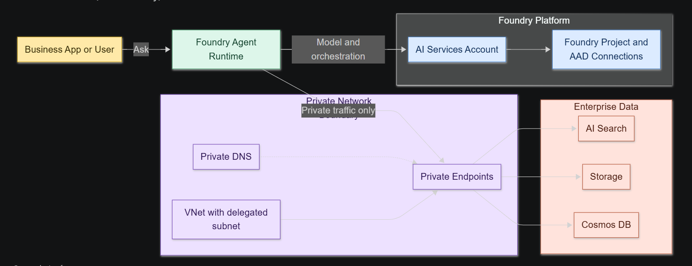

# Slide Deck Outline: Private Network Azure AI Foundry Agent Workshop

Use this as a speaker-ready structure for a 60 to 90 minute instructor-led deck that supports the hands-on labs.

Series: Private Network Foundry Agent Workshop Suite  
Version: 2026-04-26  
Primary reference: foundry-private-network-agent-guide.md

Use with:
- foundry-private-network-agent-hands-on-workshop.md
- foundry-private-network-agent-hands-on-workshop-2h.md
- foundry-private-network-agent-workshop-internal-trainer-playbook.md
- foundry-private-network-agent-participant-worksheet.md

## Slide 1 - Title
- Private Network Azure AI Foundry Agent Workshop
- Presenter, date, audience

Speaker notes:
- State workshop objective in one sentence.

## Slide 2 - Why Private Network for Agents
- Compliance and data boundary requirements
- Private endpoint and managed identity patterns
- Reduced attack surface

Speaker notes:
- Tie to enterprise controls and audit needs.

## Slide 3 - End-State Architecture
- VNet with delegated subnet and PE subnet
- AI Services account + model deployment
- Project capability host linked to Search, Storage, Cosmos

Speaker notes:
- Emphasize two capability host levels: account and project.

## Slide 4 - Deployment Flow at a Glance
- Ordered sequence from RG to agent test
- Highlight critical dependency points

Speaker notes:
- Explain why ordering prevents hard-to-debug failures.

## Slide 5 - Prerequisites and Guardrails
- Required roles and permissions
- Supported regions and quota checks
- CLI and tooling baseline

Speaker notes:
- Call out common preflight misses.

## Slide 6 - Networking Foundation
- Address spaces and subnet purposes
- Delegation requirement for `agent-subnet`

Speaker notes:
- Stress exclusive subnet use for Microsoft.App environments.

## Slide 7 - Backing Services Security Posture
- Search, Storage, Cosmos DB hardened settings
- Public network access disabled

Speaker notes:
- Explain why AAD auth is used for project connections.

## Slide 8 - Creating AI Services Account via REST
- Why REST is used (preview API and network injection)
- Minimal required payload fields

Speaker notes:
- Mention account-level capability host is created from this step.

## Slide 9 - Private Endpoints and Private DNS
- Required endpoints and DNS zones
- Zone links and A record validation

Speaker notes:
- Show how DNS correctness proves private path wiring.

## Slide 10 - Foundry Project and Connections
- Project identity creation
- Connection categories and targets
- AAD auth-only configuration

Speaker notes:
- Reinforce naming consistency for connection mapping.

## Slide 11 - RBAC Before Capability Host
- Storage and Cosmos roles
- Search roles
- Propagation wait requirement

Speaker notes:
- This slide should be treated as non-negotiable gating criteria.

## Slide 12 - Project Capability Host (Most Critical)
- Capability host payload fields
- Async operation and polling pattern
- Success and failure states

Speaker notes:
- Explain failure recovery: fix RBAC, recreate the project capability host.

## Slide 13 - Verification Checklist
- Capability host status checks
- Connection checks
- Private endpoint and DNS checks
- Model deployment check

Speaker notes:
- Ask teams to capture evidence for each check.

## Slide 14 - Agent Creation and Tool Validation
- Portal access path (inside private network)
- Add Search tool from project connection
- Run test prompt

Speaker notes:
- Point out this is the final proof of end-to-end success.

## Slide 15 - Troubleshooting Patterns
- Invalid endpoint or connection failed
- Capability host failed provisioning
- Embedding permission denied

Speaker notes:
- Map each symptom to likely root cause and fix.

## Slide 16 - Cleanup and Cost Control
- Delete project capability host first
- Delete resource group

Speaker notes:
- Remind teams not to leave resources running.

## Slide 17 - Recap and Key Takeaways
- What was built
- Why sequence and RBAC matter
- Next-step options

Speaker notes:
- Provide path to production hardening and automation.

## Slide 18 - Appendix
- Command references
- API versions used
- Role matrix summary

Speaker notes:
- Keep appendix in deck for troubleshooting support.

## Screenshot Placeholders

Store slide visuals in `assets/screenshots/slide-outline/`.

- `01-keynote-view-6-box.png`
- `02-executive-view-slide-friendly.png`
- `03-technical-view-implementation-detail.png`
- `04-private-endpoint-evidence.png`
- `05-final-validation-checklist.png`

Optional markdown placeholder:

